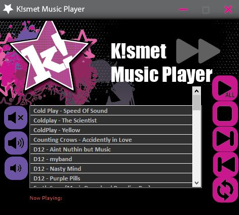

# KISMET Music Player

## Description
A MP3 player that allows users to import a playlist and play, stop, repeat, and skip songs. Volume controls such as volume up, down, and mute are also available.

## Technologies
KISMET Music Player is written in **AutoHotkey** and compiled with **SciTE4AutoHotKey** IDE. It uses many libraries already included in the language for media interaction including the song actions and volume controls

## Complications and Solutions
### Complication:
Due to the way Autohotkey audio features are setup the audio thread is either set to not continue unless the song is over or to play a new song as soon as another song is accessed. This posed a problem for the repeat feature in the application.

When the user hit repeat either the song started over right away in repeat mode, or repeat was forgotten about all together because the thread was locked during the duration of the song.

### Solution:
My solution was to integreate a .DLL file into the application which grabs the media information on the song chosen for repeat. I wrote a function to extract the length of the song and converted it to milliseconds. The song play duration was tracked every time a song was played and if the user hit the repeat button a function calculated how much time was left in the song and then dropped into a function timer so that when the song ended the repeat process would begin after.

## Screenshots



## Installation
1. Download and Install **[AutoHotKey](https://www.autohotkey.com/)** onto your machine
2. Download and install the AutoHotKey IDE -  **[SciTE4AutoHotKey](https://fincs.ahk4.net/scite4ahk/)** onto your machine

3. Clone the repository down to your local drive by opening up a terminal in the folder of your choice and type the code: 
```bash
git clone https://github.com/KISMET-INC/MusicPlayer.git
```
4. Double click the **Kismet Music Player.ahk** file to launch the application.
5. To edit the code open the AutoHotKey IDE and select the **Kismet Music Player.ahk**


## Future Updates
There are no updates for this application planned for the future.

## Contributing
If you are intersted in contributing to this project send an email to **kmoreland909@gmail.com**


## Support
Any questions or comments about this repository and it's contents can be emailed to **kmoreland909@gmail.com**.
